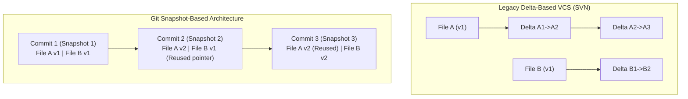

---
tags:
  - git
  - architecture
  - fundamentals
  - pedagogy
date: 2026-09-29
---

# 01 - What is Git? (The Photography Studio Analogy)

Up-Link: [[Index - Git Architecture Mastery]]

---

## 🎨 Real-Life Analogy: The High-Tech Photo Studio

Imagine you manage a museum room filled with paintings, furniture, and sculptures. You want to keep a complete record of every change made over time.

Instead of writing down detailed descriptions of what changed (*"Moved table 2 inches left, changed painting frame"*), you hire a **super-fast photographer**:

1. **Full Snapshots**: Every time you make changes, the photographer takes a full high-resolution **photo snapshot** of the room.
2. **Smart Reuse (Deduplication)**: If the table and chairs haven't moved since yesterday, the photographer doesn't take new individual photos of them. They simply link yesterday's photos into today's album!
3. **Immutable History**: Once a photo album page is sealed, no one can erase or tamper with it without tearing the page fingerprint.

> [!NOTE] Key takeaway
> **Git is not a delta engine (it does not record difference scripts between files). Git is a DAG of full-filesystem snapshots.**

---

## 🏛️ Ground-Truth Concept

In traditional Version Control Systems (like SVN), changes were stored as file-by-file delta lists (`v1 -> diff1 -> diff2`).

In **Git**, every commit takes a **snapshot** of what all your files look like at that moment. To be efficient, if a file hasn't changed, Git doesn't re-store the file — it just creates a hard reference link to the previous identical file blob!

### 📊 Visual Representation: Delta Storage vs Git Snapshot Storage



---

## 🧪 Terminal Grounding
Check your local repo snapshot status:
```bash
git status
git log --oneline
```

Next Note: [[02 - The Four Git Objects]]
