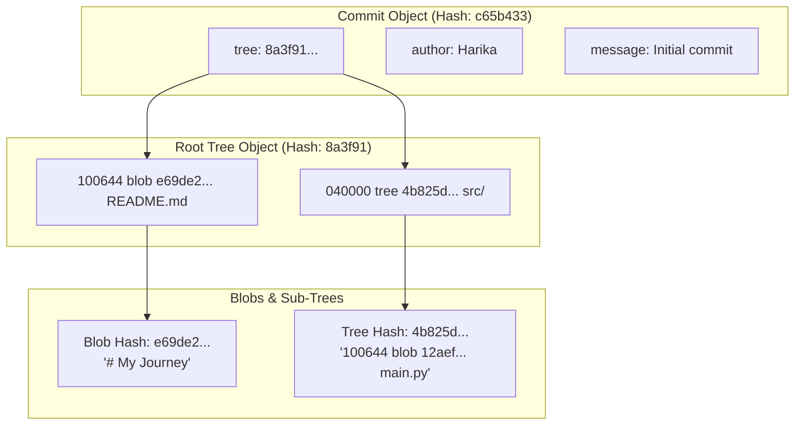

---
tags:
  - git
  - objects
  - internal-data-structures
date: 2026-09-29
---

# 02 - The Four Primitive Git Objects

Up-Link: [[Index - Git Architecture Mastery]] | Previous: [[01 - What is Git (The Photo Studio Analogy)]] | Next: [[03 - Content-Addressable Storage and Hashing]]

---

## 🎨 Real-Life Analogy: The Safe-Deposit Storage Facility

Imagine a secure storage warehouse with 4 specific types of items:

1. 📄 **Blob (The Document Sheet)**: The raw sheet of paper inside a unlabeled sealed box. It contains text, but has no title or folder label on it.
2. 📁 **Tree (The Filing Folder)**: A manila folder with an index list glued on front. It says:
   - *"File named 'resume.txt' is stored in Box #e69de29"*
   - *"Subfolder named 'projects' is folder #3b18e51"*
3. 📜 **Commit (The Log Card)**: A signed card pinned to the album snapshot:
   - *"Root folder is #3b18e51. Author: Harika. Date: Today. Log: Added new feature."*
4. 🏷️ **Annotated Tag (The Gold Seal Star)**: A wax seal stamped on a specific Log Card declaring *"Version 1.0 Release!"*

---

## 🏛️ First-Principles Schema

Git stores everything in `.git/objects/` under these 4 primitives:

| Object Type | Stored Data | Contains Filenames? | Contains Timestamps? |
| :--- | :--- | :--- | :--- |
| **Blob** | Raw file contents | ❌ No | ❌ No |
| **Tree** | Directory listing (filename, permissions, mode, object hashes) | ────── Yes | ❌ No |
| **Commit** | Top-level Tree SHA, Parent Commit SHA(s), Author, Message | ❌ No | ────── Yes |
| **Tag** | Targeted Commit SHA, Tagger name, Tag name, Message | ❌ No | ────── Yes |

---

## 📊 Visual Representation: How Objects Connect



---

## 🧪 Terminal Verification Command

You can inspect any object hash in your `.git` directory using low-level plumbing commands:

```bash
# View object type
git cat-file -t HEAD

# View object contents
git cat-file -p HEAD
```
