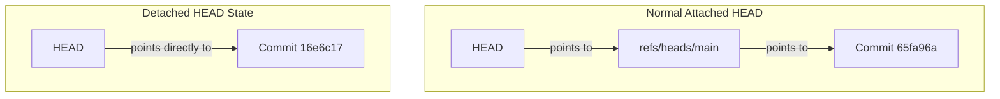

---
tags:
  - git
  - branches
  - head
  - pointers
date: 2026-09-29
---

# 04 - References, HEAD, and Branches

Up-Link: [[Index - Git Architecture Mastery]] | Previous: [[03 - Content-Addressable Storage and Hashing]] | Next: [[05 - Hands-On Terminal Plumbing]]

---

## 🎨 Real-Life Analogy: Sticky Notes & Bookmarks

Imagine a thick photo album containing pages of project history:

- **Branch (`main`, `feature`)**: A simple **sticky note** placed on a specific page of the album. Writing code and committing simply moves the sticky note to the new page!
- **`HEAD`**: Your **bookmark**. It points to whichever sticky note (branch) you are currently reading.

```
                   +-------------------+
                   |   HEAD (Bookmark) |
                   +-------------------+
                             |
                             v
                 +-----------------------+
                 |  main (Sticky Note)   |
                 +-----------------------+
                             |
                             v
                 +-----------------------+
                 | Commit Page #65fa96a  |
                 +-----------------------+
```

---

## 🏛️ First-Principles: What are Branches and HEAD on Disk?

Branches in Git are **not** heavy directories or parallel copies of files. A branch is literally a **41-byte text file** inside `.git/refs/heads/`!

### Normal State vs. Detached HEAD State

1. **Normal Attached HEAD**:
   - `.git/HEAD` contains `ref: refs/heads/main`
   - `.git/refs/heads/main` contains `65fa96a...`
2. **Detached HEAD**:
   - Happens when you check out a specific commit directly (`git checkout 16e6c17`).
   - `.git/HEAD` now directly contains `16e6c17...` instead of pointing to a branch file!

---

## 📊 Visualizing Attached vs Detached HEAD



> [!WARNING] Detached HEAD Warning
> Any new commits made while in a Detached HEAD state are **unreferenced by any branch sticky note**. If you switch away without creating a new branch, those commits become eligible for Git's garbage collection (`git gc`)!

---

## 🧪 Terminal Verification

```bash
# See where HEAD is pointing
cat .git/HEAD

# See the commit hash in branch main
cat .git/refs/heads/main
```
