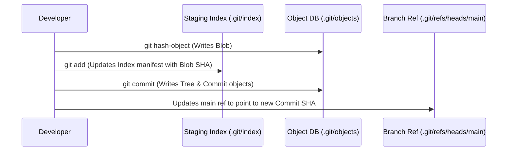

---
tags:
  - git
  - terminal
  - low-level
  - plumbing
date: 2026-09-29
---

# 05 - Hands-On Terminal Plumbing (.git Directory)

Up-Link: [[Index - Git Architecture Mastery]] | Previous: [[04 - References HEAD and Branches]]

---

## 🎨 Real-Life Analogy: Popping Open the Engine Hood

High-level Git commands (`git add`, `git commit`, `git push`) are like the steering wheel and gas pedal of a car (**Porcelain commands**).

Plumbing commands (`git cat-file`, `git hash-object`, `git ls-tree`) are like inspecting the engine pistons and fuel injectors (**Plumbing commands**).

---

## 🏛️ Ground-Truth Layout of `.git/` Directory

```
.git/
├── HEAD            -> Text file pointing to current active branch ref
├── config          -> Repository-specific settings
├── index           -> Staging area binary file (cache of workspace tree)
├── objects/        -> Key-Value database storing Blobs, Trees, Commits
│   ├── 16/         -> First 2 characters of 40-char SHA-1 hash
│   └── 65/
└── refs/
    ├── heads/      -> Local branch reference files (e.g. main)
    └── remotes/    -> Remote tracking branch refs (e.g. origin/main)
```

---

## 🧪 Terminal Command Runbook

### 1. View Object Database Summary
```bash
# List all object directories
ls -la .git/objects
```

### 2. Deconstruct Current Commit & Tree Stack
```bash
# Get SHA-1 of latest commit
COMMIT_HASH=$(git rev-parse HEAD)
echo "Commit SHA: $COMMIT_HASH"

# View Commit Object details
git cat-file -p $COMMIT_HASH

# View Tree Object details
git cat-file -p HEAD^{tree}
```

### 3. Hash a File Without Staging It
```bash
# Calculate SHA-1 blob hash of any file
git hash-object README.md
```

---

## 📊 Summary Object Tree Flow


